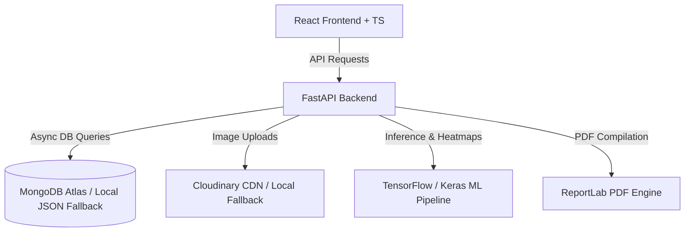

# Project Documentation: AI Skin Disease Detection & Recommendation System

Welcome to the comprehensive technical documentation for the **AI Skin Disease Detection and Recommendation System**. This project is a full-stack, educational healthcare web application designed to assist users in screening for common skin conditions, explaining AI inference transparently, and recommending clinical resources and educational guidance.

---

## 1. Project Overview

The **AI Skin Disease Detection and Recommendation System** provides an end-to-end flow for skin disease analysis:
1. **User Authentication & Session Management**: Secure user registration, logins, password reset, and user dashboard management.
2. **Quality-Assured Image Upload**: Drag-and-drop file upload with real-time pre-checks for blur and low-light conditions to ensure high-fidelity inputs.
3. **Multi-Class AI Inference**: Input images are classified using deep learning. The app runs a pipeline that classifies images into 11 categories. For testing and development, a deterministic mock predictor can be toggled via `USE_MOCK_MODEL=true`.
4. **Grad-CAM Explanations**: Heatmaps highlighting the exact regions of interest (lesions) that the neural network focused on during inference, providing explainability (XAI).
5. **Severity & Educational Recommendation Engine**: Multi-lingual guidance tailored to the classification result and severity. This includes:
   - Specific skincare rules and lifestyle adjustments.
   - Recommended and discouraged diets.
   - Hydration advice and educational medication information.
   - Doctor-consultation triggers and warning signs.
6. **Healthcare Directory (India)**: A searchable catalog of dermatologists and hospitals in India with mapping coordinates and favorites lists.
7. **Report Generation**: Automatic PDF report creation detailing the upload image, predictions, recommendations, and a validation QR code.
8. **Admin Panel & Operations**: Allows administrators to manage users, customize/update the disease database, update the healthcare directory, and trigger ML model retraining directly from the UI.

---

## 2. Technology Stack & Frameworks

The application is structured into a clean decoupled architecture (separate Frontend and Backend) with containerization support.



### 🧠 Machine Learning Engine
*   **TensorFlow & Keras**: Used to define and train the Deep Convolutional Neural Network.
*   **OpenCV (cv2) & NumPy**: For image decoding, resizing, matrix manipulations, and computing Grad-CAM heatmap overlays.

### 🔌 Backend (FastAPI API)
*   **FastAPI**: Modern, high-performance web framework for Python 3.10+.
*   **Motor**: Async driver for MongoDB, facilitating non-blocking database queries.
*   **Pydantic**: Data validation and setting management.
*   **PyJWT & Passlib (Bcrypt)**: JSON Web Token creation, signature verification, and secure password hashing.
*   **Cloudinary SDK**: Remote storage for uploaded patient files and Grad-CAM output heatmaps.
*   **ReportLab & qrcode**: PDF generation engine with dynamic QR-code creation.
*   **SlowAPI**: Rate limiting library for endpoints (e.g. login attempts and prediction runs).

### 🎨 Frontend (React App)
*   **React (v18+) & TypeScript**: Strict typing and component-based frontend framework.
*   **Tailwind CSS**: Utility-first CSS framework for modern, responsive layouts.
*   **React Router**: Handling UI navigation.
*   **Framer Motion**: Smooth page transitions and interactive micro-animations.
*   **Recharts**: Visual charts displaying probability distributions for top-3 disease classes.
*   **i18next**: Multi-language localization wrapper (preloaded with English, Hindi, and Gujarati translations).

---

## 3. Data Models & API Schemas

The system uses Pydantic schemas on the API layer and structured object document shapes in MongoDB (with transparent fallback to local JSON files if the database is offline).

### 👥 User Data Model (`UserModel`)
Stored in the `users` collection.
```python
{
    "full_name": str,
    "email": str,
    "hashed_password": str,
    "role": "user" | "admin",
    "preferred_language": str,
    "is_verified": bool,
    "created_at": datetime,
    "favorite_doctors": list[str],   # List of Doctor ObjectIDs
    "favorite_hospitals": list[str], # List of Hospital ObjectIDs
}
```

### 📈 AI Prediction Schema (`PredictionResponse`)
The data model returned after completing image analysis and Grad-CAM overlay generation.
```python
class DiseasePrediction(BaseModel):
    disease: str
    title: str | None = None
    confidence: float

class PredictionResponse(BaseModel):
    prediction_id: str
    top_predictions: list[DiseasePrediction]
    primary_disease: str
    primary_disease_title: str | None = None
    confidence: float
    severity: Literal["Mild", "Moderate", "Severe"]
    image_url: str | None = None
    gradcam_image_url: str | None = None
    image_quality_warnings: list[str] = []
```

### 📋 Recommendation Schema (`RecommendationResponse`)
Supplements the prediction with tailored self-care guidance.
```python
class RecommendationResponse(BaseModel):
    disease: str
    severity: str
    skin_care: list[str]
    lifestyle: list[str]
    diet_recommended: list[str]
    diet_avoid: list[str]
    hydration: str
    medication_info: dict
    severity_guidance: str
    when_to_consult_doctor: list[str]
    emergency_warning_signs: list[str]
```

---

## 4. Machine Learning Model Architecture

The primary machine learning pipeline uses **EfficientNetV2-L** as its backbone. EfficientNetV2-L offers state-of-the-art accuracy on computer vision tasks while optimizing parameter counts through Fused-MBConv blocks.

```mermaid
graph LR
    Input[Input Image 384x384x3] --> Aug[Data Augmentation / MixUp]
    Aug --> Backbone[EfficientNetV2-L Backbone Imagenet Weights]
    Backbone --> GAP[Global Average Pooling 2D]
    GAP --> BN1[Batch Normalization]
    BN1 --> Dense1[Dense Layer 512 + GELU]
    Dense1 --> Drop1[Dropout 0.4]
    Drop1 --> Dense2[Dense Layer 256 + GELU]
    Dense2 --> Drop2[Dropout 0.24]
    Drop2 --> Softmax[Softmax Layer 11 Classes]
```



### 🛠️ Model Customization & Phase Training Strategy
The training script (train.py) utilizes a **3-Phase Progressive Fine-Tuning** strategy to adapt the ImageNet-pretrained weights to fine-grained dermatology lesions without causing catastrophic forgetting:

1.  **Phase 1: Feature Extraction (Classification Head Training)**
    *   **Configuration**: Base model is frozen (`backbone.trainable = False`).
    *   **Optimization**: AdamW optimizer, Cosine Annealing Learning Rate schedule (initial $LR = 10^{-3}$).
    *   **Loss**: Sparse Categorical Crossentropy with Label Smoothing (0.1) to avoid neural overconfidence.
2.  **Phase 2: Partial Fine-Tuning**
    *   **Configuration**: Unfreezes the top 60 layers of the EfficientNetV2-L backbone.
    *   **Optimization**: Learning rate lowered to $10^{-5}$.
    *   **Loss**: Multi-Class **Focal Loss** ($\gamma = 2.0, \alpha = 0.25$) to actively counter class representation imbalances.
3.  **Phase 3: Deep Fine-Tuning**
    *   **Configuration**: Unfreezes all base network layers.
    *   **Optimization**: Ultra-low learning rate ($5 \times 10^{-7}$) to refine deep convolutional filters.

### 🧪 Advanced Training Features
*   **MixUp Augmentation**: Linear combinations of training images and their targets to improve decision boundaries.
*   **Test-Time Augmentation (TTA)**: During model evaluation, predictions are averaged across multiple randomly flipped/rotated versions of the input image, boosting evaluation accuracy.
*   **Class Weighting**: Underrepresented classes are heavily weighted during gradient updates.

---

## 5. Dataset Details & Class Distribution

The training pipeline expects an `ImageFolder` directory layout where folders represent separate labels. 

The application model supports **11 target categories** (including healthy skin). The current training dataset is located on the filesystem under `d:/SKIN CARE/data/IMG_CLASSES`. 

### 📊 Dataset Volume Analysis
The local dataset comprises **~40,197 images** partitioned across 10 disease categories:

| Index | Class Folder Name | Class Key in System | Approximate Images | Description |
|---|---|---|---|---|
| 1 | `1. Eczema 1677` | `Eczema` | 1,677 | Inflammatory skin condition resulting in dry, itchy patches. |
| 2 | `2. Melanoma 15.75k` | `Melanoma` | 15,750 | A serious type of skin cancer originating in melanocytes. |
| 3 | `3. Atopic Dermatitis - 1.25k` | `Atopic_Dermatitis` | 1,250 | Chronic, itchy inflammatory skin disease. |
| 4 | `4. Basal Cell Carcinoma (BCC) 3323`| `Basal_Cell_Carcinoma`| 3,323 | A common, slow-growing form of non-melanoma skin cancer. |
| 5 | `5. Melanocytic Nevi (NV) - 7970` | `Melanocytic_Nevi` | 7,970 | Benign proliferation of skin melanocytes (common moles). |
| 6 | `6. Benign Keratosis-like Lesions (BKL) 2624`| `Benign_Keratosis` | 2,624 | Non-cancerous skin growths including solar lentigines. |
| 7 | `7. Psoriasis pictures Lichen Planus ...`| `Psoriasis_Lichen_Planus`| 2,000 | Autoimmune-linked plaques and inflammatory papules. |
| 8 | `8. Seborrheic Keratoses ...` | `Seborrheic_Keratoses`| 1,800 | Common, benign skin growth often matching older age. |
| 9 | `9. Tinea Ringworm Candidiasis ...` | `Tinea_Fungal_Infections`| 1,700 | Fungal infections of the outer skin layer. |
| 10 | `10. Warts Molluscum ...` | `Warts_Viral_Infections`| 2,103 | Infectious skin growths triggered by viral infections. |
| * | *N/A (Included in ML definition)* | `Healthy_Skin` | *Varies* | Healthy, unblemished skin tissue. |
| **Total** | | | **~40,197** | |

> [!NOTE]
> Public scientific datasets like the **ISIC Archive**, **HAM10000**, and **DermNet** can be blended and organized to populate these class structures.

---

## 6. How the System Operates (Run & Deploy)

### Local Development Start
1.  **FastAPI Backend**:
    ```bash
    cd backend
    python -m venv venv
    venv\Scripts\activate   # Windows
    pip install -r requirements.txt
    uvicorn app.main:app --reload
    ```
2.  **React Frontend**:
    ```bash
    cd frontend
    npm install
    npm run dev
    ```

### Production Deployment
*   **Infrastructure**: Managed easily through docker-compose.yml, bundling MongoDB, Backend, and Frontend.
*   **Frontend**: Deployed to Vercel/Netlify.
*   **Backend**: Managed as a Docker container on Render, AWS, or GCP.
*   **Database**: MongoDB Atlas cloud cluster.
*   **Asset Storage**: Cloudinary Media Suite.
