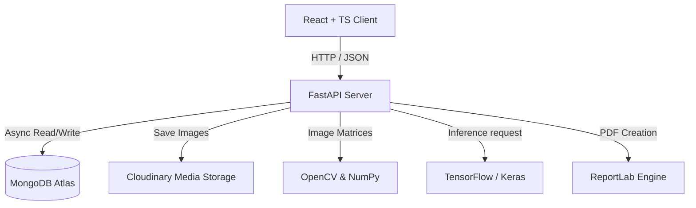
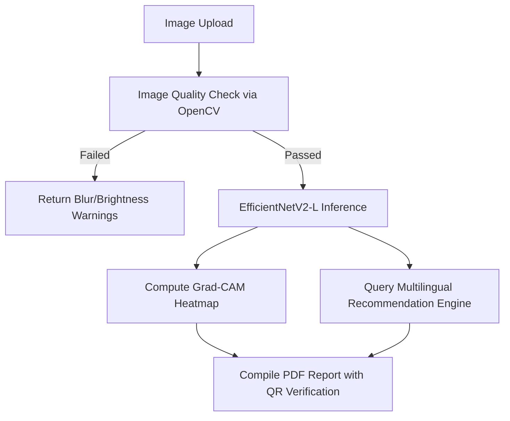

# System Overview: AI Skin Disease Detection & Recommendation System

This document provides a concise technical overview of the **AI Skin Disease Detection and Recommendation System**. It summarizes the technology stack, dataset specifications, model architecture, and training methodologies implemented in the application.

---

## 1. Technologies Used (Tech Stack)

The system is split into a decoupled **Frontend client** and **Backend API** communicating via RESTful interfaces, with standard data validation and containerization tools.



### 🎨 Frontend (UI/UX)
*   **React (TypeScript)**: SPA structure with strict typing.
*   **Tailwind CSS**: Modern utility styling supporting light/dark theme toggles.
*   **React Router**: client-side navigation.
*   **Recharts**: Interactive probability charts for top-3 predictions.
*   **i18next**: Translation wrapper for dynamic English, Hindi, and Gujarati localization.
*   **Framer Motion**: Page transitions and interactive hover micro-animations.
*   **Leaflet.js**: Geolocation mapping for Indian dermatologists and clinics.

### 🔌 Backend (API Gateway)
*   **FastAPI**: Asynchronous web framework for high-throughput endpoint routing.
*   **Motor**: Async driver for MongoDB connection.
*   **python-jose (JWT) & passlib (Bcrypt)**: Session authentication and password encryption.
*   **SlowAPI**: Rate limiting to secure prediction and login endpoints.
*   **ReportLab & qrcode**: PDF compiler that formats dynamic Patient Assessment Reports embedded with verification QR codes.

### 🧠 Machine Learning & Inference
*   **TensorFlow & Keras**: Model execution and training.
*   **OpenCV (cv2) & NumPy**: Image preprocessing, quality pre-checks (blur, low-light, skin ratio), and Grad-CAM math matrix operations.

---

## 2. Dataset Details (Data Volume)

The model is trained on a fine-grained dermatological image collection containing **~40,197 images** partitioned into 10 disease categories.

### 📊 Class Distribution Table

| Index | Disease Class Folder | DB Key Mapping | Images Count | Primary Medical Description |
| :---: | :--- | :--- | :---: | :--- |
| **1** | `1. Eczema 1677` | `Eczema` | 1,677 | Inflammatory skin condition resulting in red, dry, itchy patches. |
| **2** | `2. Melanoma 15.75k` | `Melanoma` | 15,750 | Serious skin cancer originating in pigment-producing melanocytes. |
| **3** | `3. Atopic Dermatitis - 1.25k` | `Atopic_Dermatitis` | 1,250 | Long-lasting (chronic) dry skin causing intensive flares. |
| **4** | `4. Basal Cell Carcinoma (BCC) 3323` | `Basal_Cell_Carcinoma` | 3,323 | A common, slow-growing, highly treatable non-melanoma cancer. |
| **5** | `5. Melanocytic Nevi (NV) - 7970` | `Melanocytic_Nevi` | 7,970 | Benign clusters of skin pigment cells (common moles). |
| **6** | `6. Benign Keratosis-like Lesions (BKL) 2624` | `Benign_Keratosis` | 2,624 | Non-cancerous waxy/scaly lesions including solar lentigines. |
| **7** | `7. Psoriasis pictures Lichen Planus...` | `Psoriasis_Lichen_Planus` | 2,000 | Autoimmune-linked scaly plaques and purple flat bumps. |
| **8** | `8. Seborrheic Keratoses...` | `Seborrheic_Keratoses` | 1,800 | Common, harmless, "stuck-on" waxy skin growths. |
| **9** | `9. Tinea Ringworm Candidiasis...` | `Tinea_Fungal_Infections` | 1,700 | Superficial fungal infections affecting the outer skin layers. |
| **10**| `10. Warts Molluscum...` | `Warts_Viral_Infections` | 2,103 | Highly contagious skin lesions triggered by viral infections. |
| **-** | *Healthy skin (Synthesized)* | `Healthy_Skin` | *Varies* | Baseline healthy, unblemished skin cells for normalization. |
| **Total**| | | **~40,197** | **Large-scale training dataset** |

---

## 3. Deep Learning Model Architecture

The core prediction classifier is built using the state-of-the-art **EfficientNetV2-L** model backbone, which uses Fused-MBConv convolutional filters.

```
Input Image (384x384x3)
        │
        ▼
[Data Augmentation / MixUp]
        │
        ▼
[EfficientNetV2-L Backbone (Pre-trained ImageNet weights)]
        │
        ▼
[Global Average Pooling 2D]
        │
        ▼
[Batch Normalization]
        │
        ▼
[Dense Layer (512 units, GELU activation)]
        │
        ▼
[Dropout (Rate: 0.40)]
        │
        ▼
[Dense Layer (256 units, GELU activation)]
        │
        ▼
[Dropout (Rate: 0.24)]
        │
        ▼
[Softmax Classification Output (11 Classes)]
```

---

## 4. Methodology & Algorithms



### 🔄 Progressive 3-Phase Fine-Tuning Strategy
To adapt the general features of ImageNet to complex, detailed skin lesions without losing structural memory, we train in three stages:
1.  **Phase 1: Feature Extraction (Frozen Base)**
    *   *Parameters*: Backbone network is frozen (`trainable=False`).
    *   *Optimizer*: AdamW (Initial Learning Rate = $10^{-3}$) with Cosine Decay.
    *   *Objective*: Train the classification head to align with skin classes.
2.  **Phase 2: Partial Fine-Tuning (Top 60 Layers)**
    *   *Parameters*: Top 60 layers of the backbone are unfrozen.
    *   *Optimizer*: Learning Rate reduced to $10^{-5}$.
    *   *Objective*: Adapt fine-grained high-level filters to texture and border margins.
3.  **Phase 3: Deep Fine-Tuning (Full Unfreeze)**
    *   *Parameters*: Entire model is unfrozen.
    *   *Optimizer*: Learning Rate set to $5 \times 10^{-7}$.
    *   *Objective*: Perform micro-adjustments across all weight layers.

### 🧪 Training Enhancements
*   **MixUp Augmentation**: Blends training images and label distributions (e.g. 70% Eczema + 30% Ringworm) to smooth decision boundaries and reduce overconfidence.
*   **Label Smoothing (0.1)**: Softens target targets (e.g., $0.9$ instead of $1.0$) to prevent logit output explosion and over-fitting.
*   **Focal Loss (Phase 2 & 3)**: Dynamically weights samples based on difficulty, focusing gradient updates on hard, misclassified samples to fight class imbalance.
*   **Test-Time Augmentation (TTA)**: During inference, the input image is augmented (horizontal flips, slight rotations) and evaluated multiple times. The scores are averaged to yield the final robust prediction.

### 🔍 Explainable AI (Grad-CAM)
*   **Mechanism**: Computes the gradient of the predicted class score with respect to the output feature maps of the final convolutional layer of the EfficientNet backbone.
*   **Heatmap Generation**: Computes a weighted sum of the feature maps, applies a Rectified Linear Unit (ReLU) to isolate positive contributions, normalizes the matrix, and overlays a jet color map onto the original image.
*   **Graceful Fallback**: If Keras is offline, the backend implements an OpenCV color segmentation and texture gradient analyzer to detect the lesion contour and overlay a realistic Gaussian heatmap.
